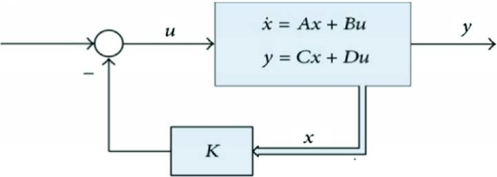

# Balancing Lower Body for pib

## Introduction

To aquire stable movement on the ground for pib, we created a wheel leg hybrid to achieve both; fast, energy efficient and manuevarbility of wheels and ability to squat and change posture of legs. For this system, balancing is a fundamental capability to enable stability. In this project, we focus on balancing the lower body of pib, using control algorithms applied to a simplified model of an inverted pendulum on a cart. By implementing control strategies like PID and LQR, we aim to keep the robot upright and stable while moving.

## MJbots MOTEUS

[Moteus](https://github.com/mjbots/moteus) is a high-performance servo motor controller designed by MJBots. It is ideal for robotic applications requiring precise motion control. Moteus offers advanced features such as torque, position, and velocity control, making it suitable for implementing sophisticated control algorithms needed for balancing tasks. We will be using R4.1 controller for this project to control 90kv eagle power brushless motor. The internal control loops for the motor is explained in [PID for motor](https://pib-rocks.atlassian.net/wiki/x/AQBGEg)

## Installation

Clone the repository and navigate to the balancing directory:

```
git clone https://github.com/pib-rocks/moteus-motor-control.git
cd moteus-motor-control/python/balancing
```
Install the required Python packages:
```
pip install -r requirements.txt
```

Configure the motors by running:
```
python3 settings.py
```

## Quick Scripts for LQR and PID Balancing

To quickly test the balancing algorithms on a 1 DOF inverted pendulum system (not on a cart), run the following scripts.
[PID 0 pitch](https://youtube.com/shorts/0coK8HC5Wkk?feature=share)
[LQR 0 pitch](https://youtube.com/shorts/olOWUviZS1A?feature=share)

### PID Balancing

```bash
python3 pid_balancing.py
```

### LQR Balancing

```bash
python3 lqr_balancing.py
```

## Balancing System Explanation

The balancing system models the lower body of PIB as an inverted pendulum mounted on a cart. The cart represents the wheel base, and the pendulum represents the robot's torso. The objective is to apply control inputs to the motors (cart) to keep the pendulum (robot) balanced upright. This setup simplifies the complex dynamics of a humanoid robot to a more manageable control problem. The goal is to keep angular pitch velcoity at 0 and pitch angle upright. To achieve this we are using Tinkerforge IMU bricklet to provide orientation and angular velocity feedback.

## PID Balancing

### PID Controller Explanation

A PID controller computes an error value as the difference between a desired setpoint and a measured process variable. It applies a correction based on proportional (P), integral (I), and derivative (D) terms. In our case, we use a PD controller (proportional and derivative terms only) to balance the inverted pendulum.

The control input \( u(t) \) is calculated as:

$$
u(t) = K_p e(t) + K_d \frac{{de(t)}}{{dt}}
$$

- e(t): Error between the desired angle (upright position) and the current angle.
- Kp: Proportional gain.
- Kd: Derivative gain.


The proportional term adjusts the control input proportional to the error, while the derivative term predicts system behavior, providing damping and improving stability. With PID we are running one loop to minimize angular pitch angle to zero by doing velocity control.
videos
[Disturbance compensation with PID](https://youtube.com/shorts/M5Nd9FfMVe8?feature=share)

### Running the PID Script

Execute the PD balancing script:

```bash
python3 pid_balancing.py
```

Ensure that the gains \( K_p \) and \( K_d \) are properly tuned in the script for optimal performance.

## System Dynamics

The inverted pendulum on a cart can be described by the following equations of motion:

$$
m \ddot{x} + m l \ddot{\theta} \cos \theta - m l \dot{\theta}^2 \sin \theta = F
$$

$$
m l \ddot{x} \cos \theta + m l^2 \ddot{\theta} - m g l \sin \theta = 0
$$

Where:
- x: Position of the cart.
- theta: Angle of the pendulum (from vertical).
- m: Mass of the pendulum.
- l: Length to the pendulum's center of mass.
- F: Force applied to the cart.
- g: Acceleration due to gravity.
These nonlinear equations describe the coupling between the cart and pendulum dynamics.

## State-Space Representation

Linearizing the system around the upright position (\( \theta \approx 0 \)), we obtain the state-space representation:

$$
\dot{\mathbf{x}} = A \mathbf{x} + B u
$$

$$
\mathbf{y} = C \mathbf{x} + D u
$$

State vector:

$$
\mathbf{x} = \begin{bmatrix} x \\ \dot{x} \\ \theta \\ \dot{\theta} \end{bmatrix}
$$

Input vector:

$$
u = F
$$

System matrices:

$$
A = \begin{bmatrix}
0 & 1 & 0 & 0 \\
0 & 0 & -\frac{m g}{M} & 0 \\
0 & 0 & 0 & 1 \\
0 & 0 & \frac{(M + m) g}{M l} & 0
\end{bmatrix}, \quad
B = \begin{bmatrix}
0 \\
\frac{1}{M} \\
0 \\
-\frac{1}{M l}
\end{bmatrix}
$$

Where:
- M: Mass of the cart.
- m: Mass of the pendulum.
- l: Length to the pendulum's center of mass.
- g: Acceleration due to gravity.
This linearized model is used for designing the LQR controller.

## LQR Balancing

### LQR Controller Explanation

The Linear Quadratic Regulator (LQR) is an optimal control strategy that minimizes a cost function representing the trade-off between state error and control effort. The cost function is defined as:

$$
J = \int_{0}^{\infty} (\mathbf{x}^\top Q \mathbf{x} + u^\top R u) \, dt
$$

- Q: State weighting matrix (positive semi-definite).
- R: Control input weighting scalar or matrix (positive definite).
- \mathbf{x} \): State vector.
- u: Control input.

The optimal state-feedback gain matrix \( K \) is computed by solving the Continuous-Time Algebraic Riccati Equation (CARE):

$$
A^\top P + P A - P B R^{-1} B^\top P + Q = 0
$$

$$
K = R^{-1} B^\top P
$$

Where \( P \) is the solution to the CARE. The control law becomes:


u = -Kx

[Disturbance compensation with LQR](https://youtube.com/shorts/rGGWK-xfWDU?feature=share)
### Running the LQR Script

Execute the LQR balancing script:

```bash
python3 lqr_balancing.py
```

Ensure that the Q and R matrices are appropriately chosen in the script to balance performance and control effort. Proper tuning of these matrices is crucial for achieving optimal balancing behavior. For simplicity, in the current script there is a variable named "scale_factor" that should be adjusted to scale control output.

## References

- [Josh Pieper: Hoverbot - Hoverboard Motor Balancing Robot](https://youtu.be/syxE1NEU7lw?feature=shared&t=449)
